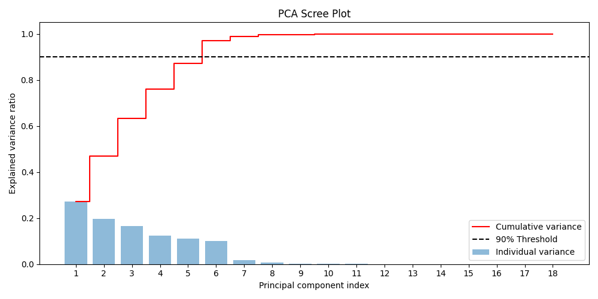
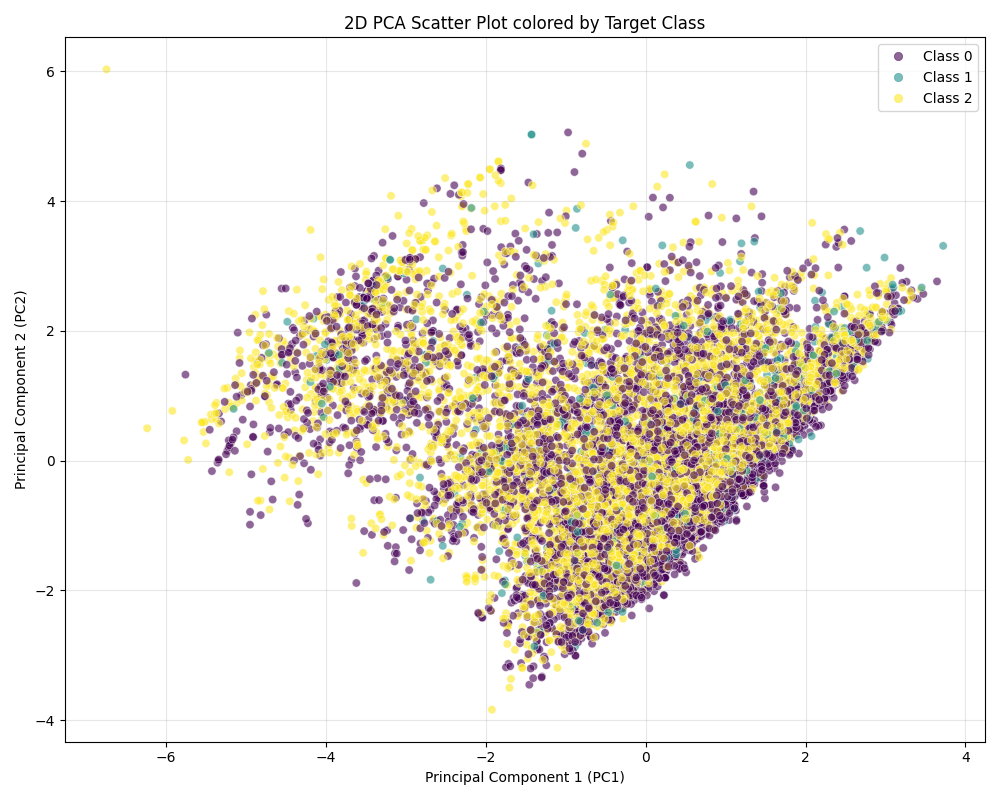
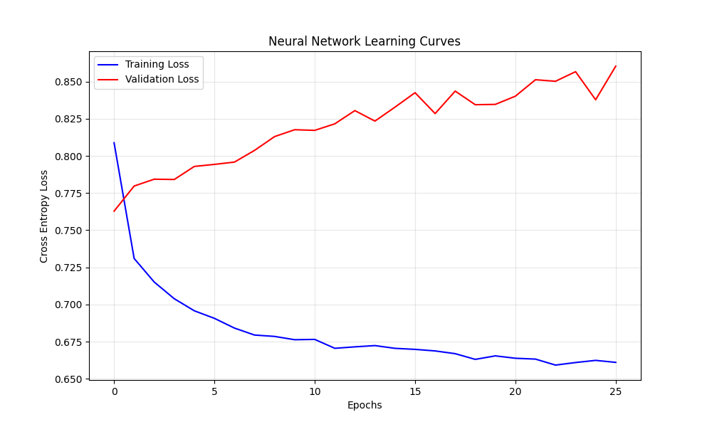
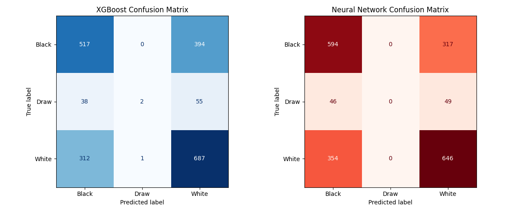

# AI Hands-on Assignement 1


## 1. Problem Description

Train a model to predict the winner of a chess game given the following inputs:

- rated
- created_at
- last_move_at
- turns
- increment_code
- white_rating
- black_rating
- opening_eco
- opening_name
- opening_ply

See the meaning of the inputs in the Section "Dataset Description."

## 2. Dataset Description

For the training of the model the following dataset is used:

- Domain: Chess
- Source [URL](https://wwwkagglecom/datasets/datasnaek/chess)
    - _Note_: the generation method did not really work due to authentication for some reason
- Rows: 20058
- Columns: 
    - 16, original file
    - 11, after dropping columns not used in the training (see Notes below)

- Description of each feature

| Feature Name | Type | Description | Note |
| ------------ | ---- | ----------- | ---- |
| id           | Categorical | Unique game identifier | unique identifier - **drop** for ML |
| rated        | Categorical - Boolean | True if the game affects player ratings | categorical feature |
| created_at   | Numerical | Unix timestamp (start time)| conversion to datetime - difference with last_move_at|
| last_move_at | Numerical | Unix timestamp (end time)| conversion to datetime - difference with  created_at (if the game finished late at night mate in one could arrive due to fatigue ) |
| turns       | Numerical | Number of moves played| indicator for likelihood of mate in early stages - "hanging mate in one"|
| victory_status | Categorical |How the game ended among "mate- resign-outoftime-draw" | In case of draw this gives away the result; in othere cases it would be interesting to use is as a target if we are interested on how the game ends, e.g. the target is a synthetic of winner-victory status, but this gets to complicated so we migth as well **drop** it for the sake of the exercise.|
| winner       | Categorical | white - black - draw | Target (draw is only 5% in this dataset) |
| increment_code| Categorical| Time control | High cardinality - fast games (bullet-blitz) or long games (rapid-classical). The format of this column follows a pattern "number+number", like "10+0" or "5+2".|
| white_id     | Categorical | Username of White player | unique identifier - **drop** for ML |
| white_rating | Numerical | level of White player| numerical feature (usually high ranks lead to less mating results as they tend to resign) |
| black_id     |Categorical|Username of Black player| unique identifier - **drop** for ML |
| black_rating |Numerical|Skill level of Black player|same as white ranking |
| moves        | Text | game history in notation  | Needs Regex or string splits, but how useful it is? -> we could extract the captures done by the highest rated player or the checks given by some player, but on the other hand this gives the history of the game so it is not a generalistic behaviour of the model -> final verdict: **drop** |
| opening_eco  |Categorical|Opening classification code| certain openings lead to more "edgy" games - Good for categorical encoding |
| opening_name |Categorical|Human-readable opening name|High cardinality |
| opening_ply  | Numerical | Length of the opening sequence | Number of theoretical moves -  sticking to theory leads to more balanced games positionally and games could go on more |

- The goal is to predict the _winner_ of the game: white - black - draw.

From the dataset we see only 5% of the games end in draws; this actually pretty normal due to the nature of online chess with beginners and intermediate players.

_Note_: the columns notes above are dropped during the loading of teh dataset. The approach of the target to be picked out of two columns (winner+victory_status) seems really attractive, but it is left out for now for the sake of time limitations (but will be revisited)

## 3. Preprocessing Approach

### 3.1 Splitting the data

We split the with the 80/10/10 approach.
- we drop the target column winner from the df
- we use the method `train_test_split` of the scikit-learn library
- caution needed for the few rows where we have the value "draw" in our target; for this we use `stratify`.

The results for the splitting process are as follows

| Set |  Number of rows (percentage on df rows) | Draw Percentage |
| --- | ---------------------------- | --------------- |
| Training set  | 16046 rows (80%) | 4.74% |
| Validation set| 2006 rows (10%) | 4.74% | 
| Test set      | 2006 rows (10%) | 4.74%|

### 3.2 Missing values

Although the dataset we are using does not have missing values we need to create an actual strategy to handle it,
in case the dataset we will use in the future has missing values.

We use `SimpleImputer` from the scikit-learn library, as the instructions advice to use mean or median values; an alternative would be the KNNImputer. we `fit` only to the training data to avoid data-leakage and then transform all three datasets (training, test, validation).

The approach we use is the following:

| Feature Type | Columns | Strategy Applied  | Reason |
| ------------ | ------- | ----------------  | ------ |
| Target       | winner  | Drop missing rows | As stated in the instruction; a supervised model cannot learn without the answer key |
| Numerical    | turns, ratings, opening_ply | Median Imputation | Chess _ratings_ and _turn_ counts are often skewed by outliers (e.g., 2700-rated GMs or 2-turn games). Median is safer than Mean.|
| Categorical  | rated, opening_eco, etc.    | Mode: Most Frequent | Replaces missing text with the most common category found in the training data.|

_Notes_:
1. some times Scikit behaves "strange" and automatically assigns columns a different type to the data than is is actually from the `df.info()`. To this end, we explicitly assign the caterorical columns as objects using this piece of code.
    ```python
    for df in [X_train, X_validation, X_test]:
        df[cat_cols] = df[cat_cols].astype("object")
    ```

### 3.3 Outlier Detection and Treatment

We adopt the IQR method since it is more appropriate for the data, as they are not uniformly distributed (bell curve).

The detection of the outlier are applied to the following numerical features:
- turns
- white_rating
- black_rating
- opening_ply

The numerical features "*created_at*" and "*last_move_at*" are not treated in the outlier detection process. The values of these columns are "massive" integers and are used as timestamps; timestamps represent specific points in history. Capping them to a median "date" doesn't make physical sense for a model and therefore we convert them to duration later in the preprocessing.

After the detection of the outliers we "Winsorize" the outliers rather than remove them. We follow this strategy as  to preserve the integrity of the Validation and Test sets. In a real-world scenario, if a user inputs a highly unusual 250-turn game, the model cannot simply 'drop' the user's request; it should provide a prediction. By capping, we train the model to treat extreme outliers as simply 'very high' values without allowing them to distort the mathematical weights of the Neural Network.

### 3.4 Encoding Categorical Variables

The encoding method depends on the nature of the categorical variables:
- rated: boolean (True-False)
- victory status, it gives away the result if draw - dropped (although the result in a win would be a good feature to train upon.)
- winner is the target (3 labels)
- increment_code : high cardinality, a lot of game formats
- opening_eco: high cardinality 
- opening_name: high cardinality

#### 3.4.1 One-hot encoding

Ideal for the target which has values "white", "black" and "draw".

Because it is in the target, the output from the encoding process will give as an array of 0s 1s and 2s.

#### 3.4.2 Label encoding

Ideal for the rated, which is True or False, so it will be 1 or 0.

#### 3.4.3 Target endoding

Target encoding basically calculates a possibility based on the target, so we will have 3 new columns for each categorical features with high cardinality. So after the encoding we have 16 columns.

Problems to overcome with the Target encoding: overfitting, never seen categories in new datasets. 

We use the `TargetEncoder` class of the `scikit-learn` library. A very good description of how the class works can be found [here](https://towardsdatascience.com/encoding-categorical-variables-a-deep-dive-into-target-encoding-2862217c2753/). `scikit-learn` and `feature-engine` can automatically detect the optimal smoothing parameter using empirical Bayes variance estimates. To avoid data leakage we use `shuffle` and thus we set the `random_state` parameter to 42, as specified in the exercise.

_Note 1_ : This could be a good time to break the feature "*increament_code*" in two different numerical features "*base_time_mins*" and "*added_times_secs*"; this way any new time format that comes with a new dataset will be taken care by the model.

_Note 2_: the features "*opening_name*" and "*opening_eco*" have conceptually high correlation; e.g. the value D10 of the opening eco always related to the opening name "Slav defence" + some variation. However, there might be a case where opening name "Slav defence" + some other variation, does not relate to D10. (ecos and names are just for example). It might seem that we could drop one of those features as it does not give much more info. This is a coming topic on the PCA analysis.


## 4.A (3.5) Feature Engineering

The two features that can encode domain knowledge is the duration of a game and the difference between rated player.

- "last_move_at" - "created_at": The format is in Unix timestamps we will convert to Date/Time and then to minutes
- "white_rating" - "black_rating": is the differnce between the capabilities between the playes; a higher rated player will most probably win, and this is much more visible when the difference is very high. It is unlikely that a 500 player will win a 1500 player. However, it is not unlikely for a player of 2200 to win a player of 2300.

_Note_: due to the early format of the output in the dataset, in some rows, the time features "created_at" and "last_move_at" have the same value, and thus we get a "game_duration_mins" = 0. To that end we create a function to fix this 0 and set it to the median of the durations.

_Note 2_: however the duration can be more precisely "guessed" at the preprocessing by looking at the feature "increment_code", because a "5+2" game would have a duration of 5-8 minutes (median) and a "10+5" game probably a duration of 11-15. So it would be advantageous to have a median grouped by the feature "increment_code" and then drop the feature. This step takes place before encoding the categorical features. This step can be done before the encoding in our case.


### 4.B (3.6) Feature Scaling

The basic idea of the scaling is normalizing ratings (which range from 800 to 2700), and the date related features "created_at" and "last_move_at" so the Neural Network doesn't get overwhelmed by large numbers.

We select the `StandardScaler` to scale the numerical features, because we already treated our extreme outliers using the IQR capping method (Winsorization) in the previous step. Thus, a `RobustScaler` is no longer necessary. The `StandardScaler` transforms the features to have a mean of 0 and a standard deviation of 1 using the formula $z = \frac{x - \mu}{\sigma}$. This is the preferred method for Neural Networks, ensuring that massively scaled columns like created_at or white_rating do not artificially dominate smaller scaled columns like "turns" or "opening_ply".


_Note_: the numbering in the README file asked in the exercise and the numbering in the description of part 2 of the exercise do not coincide, so we keep the basic numbering of the README which is 4 for the Feature "Engineering" and add in parenthesis what it should be by the exercise description (kind-of 3 instead of 2). This is the same for the next section PCA Insights.

## 5. (3.7) PCA Insights

We run a PCA Analysis with the purpose of understanding which features carry the most information and how much variance each principal component explains. 

To this end, as the goal here is not to reduce dimensions for modelling, the code for PCA analysis is not in the code `preprocessing.py` but a standalone script in the `src` folder `pca_analysis.py` and it is called after the preprocessing.

Two images and one text file are produced in the folders images and insights respecticely. The results from the images and the text file are commented in the following sections

### 5.1 Scree plot



As we see in the image of the file "/images/scree_plot.png", the scree plot reveals that the dataset's variance is relatively distributed across multiple dimensions. It requires 6 principal components to capture 90% of the total cumulative variance. This indicates that a chess game is a complex, multi-dimensional event; the data cannot be aggressively compressed into just 2 or 3 features without losing highly significant information.

### 5.2 PCA loadings

The content in the file "*/insights/pca_features.txt*" reveals the number of components needed to explain 90% of variance which are 6 in our case.

Top Features driving Principal Component 1 (PC1)

| feature         | Weight |
| --------------- | ------ |
| last_move_at    |0.555886|
| created_at      |0.555885|
| black_rating    |0.391142|
| white_rating    |0.362634|
| opening_ply     |0.253568|

Top Features driving Principal Component 2 (PC2)
| feature         | Weight |
| --------------- | ------ |
| white_rating    | 0.549390|
| black_rating    | 0.458896|
| created_at      | 0.427984|
| last_move_at    | 0.427976|
| opening_ply     | 0.288961|

By inspecting the component weights (loadings), we can interpret the real-world meaning of the newly created synthetic axes:
- PC1 is heavily dominated by the time related features ("last_move_at", "created_at") and the players' overall skill levels (black_rating, white_rating).
- PC2 is driven by the exact same set of features, but with a slightly heavier emphasis on the ratings over the timestamps.
- The fact that the highly correlated timestamps dominated the primary axes of variance validates our earlier feature engineering decision to extract game_duration_mins. In a strict dimensionality reduction scenario, the raw timestamps would likely be dropped to prevent them from overwhelming the principal components.

### 5.3 PC1 - PC2 scatter plot



The data was projected onto a 2D scatter plot using PC1 and PC2, colored by the target class (Winner). The plot in the file "image/scatter_plot.png" displays a dense, heavily overlapping cloud of data points with no distinct clusters or linear boundaries between the classes. Because PC1 and PC2 primarily represent the duration of the game and Skill Level (Rating) of the players which are factors that dictate the environment of the game rather than the outcome, it is mathematically logical that they do not perfectly separate the winner. This confirms that predicting the outcome of a chess game is a highly non-linear classification problem that will require an algorithm capable of learning complex, higher-dimensional interactions (such as a Random Forest or Neural Network).


## 6. Model Comparison

### 6.1 Classical ML

The PCA plot shows a massive, overlapping cloud. Linear models will fail to draw straight lines through that mess.

We choose the XGBoost which is the model that is the most used and also can implement an early stopping. XGBoost is not in the scikit-learn library so we install the xgboost library: `pip install xgboost`.

The outcome of the model training stats are in the file "*insights/classical_model_report.txt*", and are presented below.

Validation Accuracy: 0.6157

Classification Report:
|                  | precision | recall | f1-score |  support |
| --------------   | ---- | ---- | ---- | ---- |
| 0                | 0.62 | 0.56 | 0.59 |  911 |
| 1                | 0.00 | 0.00 | 0.00 |   95 |
| 2                | 0.61 | 0.73 | 0.66 | 1000 |
|                  |      |      |      |      |
|  **accuracy**    |      |      | 0.62 | 2006 |
| **macro avg**    | 0.41 | 0.43 | 0.42 | 2006 |
| **weighted avg** | 0.59 | 0.62 | 0.60 | 2006 |

Top Features driving Principal Component 1 (PC1) 

| Feature              | Importance |
| -------------------- | -----------|
| (7)  rating_advantage  |  0.200694 |
| (16)    opening_name_1  |  0.164284 |
| (17)    opening_name_2  |  0.129472 |
| (15)    opening_name_0  |  0.119262 |
| (3)             turns  |  0.063530 |

Classical Machine Learning Model

- Problem type: Multiclass classification (0=Black Win, 1=Draw, 2=White Win).

- Model chosen: XGBClassifier with n_estimators=500, max_depth=6, and early_stopping_rounds=20. XGBoost was selected because the PCA scatter plot indicated highly non-linear class overlap, requiring a complex tree-based ensemble.

- Validation performance: Accuracy on X_validation was 0.6157 (61.57%). Early stopping was triggered at iteration 29. Notably, the model struggled to optimize overall accuracy with severe class imbalance, due to the "Draw" class, which is only a $4.7 %$ of the games, achieving an F1-score of 0.00 on this minority.

Feature importance: Top features driving the model were "rating_advantage" (0.20), followed by the target-encoded opening probabilities ("opening_name_1", "opening_name_2", "opening_name_0"), and "turns".

### 6.2 Neural network

For the neural network we use the recommended library pytorch; to install it use `pip install torch`.

#### Summary

- Architecture – Input(18) → Dense(64, ReLU) → Dropout(0.2) → Dense(32, ReLU) → Dropout(0.2) → Dense(3, Linear/CrossEntropy).
- Training – Adam optimizer, multi-class cross-entropy loss, batch size 64, early stopping with patience=25 monitoring val_loss.
- Validation performance – Best Val Loss on X_val: 0.7624 (reached at epoch 0, training stopped at epoch 25).
- Observation – Immediate severe overfitting observed; validation loss increased steadily from the first epoch while training loss continued to decrease. Experimenting with a Tanh activation slowed the rate of divergence but did not prevent the overfitting.

More explictily:

- Architecture: A Feedforward Neural Network with 2 hidden layers (64 nodes -> 32 nodes). Dropout of 20% (0.2) was applied to both hidden layers to prevent the model from memorizing the training set.
- Output Activation: Following PyTorch best practices for numerical stability, raw logits were outputted and combined with nn.CrossEntropyLoss, which implicitly applies the required Softmax activation for multi-class prediction.
- Early Stopping: Validation loss was monitored per epoch with a patience of 25. The model halted at epoch 25, restoring the weights that yielded the lowest validation loss to prevent overfitting from 0 epoch.

#### Activation Function Experiment - Comparison between ReLU and Tanh activation functions

- Run with ReLU activation function
```bash
Results:
Starting Neural Network Training...
Epoch   0 | Train Loss: 0.8048 | Val Loss: 0.7624
Epoch   5 | Train Loss: 0.6920 | Val Loss: 0.7963
Epoch  10 | Train Loss: 0.6745 | Val Loss: 0.8090
Epoch  15 | Train Loss: 0.6683 | Val Loss: 0.8325
Epoch  20 | Train Loss: 0.6634 | Val Loss: 0.8400
Epoch  25 | Train Loss: 0.6622 | Val Loss: 0.8591
```

Base Model (ReLU):
The model utilizing standard ReLU activations exhibited immediate overfitting. While training loss successfully decreased from 0.8048 to 0.6622, validation loss steadily increased from 0.7624 to 0.8591 over 25 epochs. Early stopping correctly identified Epoch 0 as the optimal generalization point (Val Loss: 0.7624).

- Run with activation function Tanh
```bash
Starting Neural Network Training...
Epoch   0 | Train Loss: 0.7697 | Val Loss: 0.7646
Epoch   5 | Train Loss: 0.6836 | Val Loss: 0.8156
Epoch  10 | Train Loss: 0.6777 | Val Loss: 0.8275
Epoch  15 | Train Loss: 0.6726 | Val Loss: 0.8177
Epoch  20 | Train Loss: 0.6742 | Val Loss: 0.8217
Epoch  25 | Train Loss: 0.6731 | Val Loss: 0.8159
```

Experiment (Tanh):
To evaluate the impact of different non-linearities, the architecture was tested using the Tanh activation function.

Training Behavior: Tanh exhibited the exact same immediate overfitting pattern as ReLU. However, Tanh's validation loss climbed at a slower rate, reaching 0.8159 by epoch 25 compared to ReLU's 0.8591. This is likely because Tanh's bounding property (-1 to 1) prevented the network's output logits from diverging as rapidly as the unbounded ReLU.

Validation Performance: Despite the slower divergence, Tanh failed to improve the network's actual predictive power. Its best validation loss (0.7646 at Epoch 0) was practically identical to the ReLU baseline.

Conclusion: Changing the activation function did not resolve the network's tendency to overfit this specific tabular dataset. The network's high capacity caused it to memorize noise, confirming that simpler, tree-based models like XGBoost are better suited for this specific feature space.

#### Learning Curves Plot  



Learning Curve Analysis (ReLU Base Model)

The plotted learning curves vividly illustrate the network's training dynamics and confirm the severe overfitting.

- Training Performance: The training loss (blue) decreases smoothly and consistently, indicating that the Adam optimizer is successfully minimizing error and the network is actively learning the training set.

- Validation Performance: The validation loss (red) reaches its global minimum at the very first epoch and diverges immediately, trending steadily upward for the remainder of the 25 epochs.

The growing gap between the two curves demonstrates that the network's capacity is too high for this specific tabular dataset. Rather than learning generalizable patterns to predict chess outcomes, the network immediately began memorizing the specific noise and quirks of the training data.

While dropout (p=0.2) was applied, it was insufficient to prevent this memorization. The early stopping mechanism functioned exactly as intended, halting training and correctly identifying Epoch 0 as the optimal set of weights before the overfitting degradation began. Notably, thing do not get better for dropout at 0.6, which was tested as an experiment (see file iamges/loss_curves_p06.png)


## 7. Best Model Designation

The table bellow show the comparion between the XGBoost and the Neural network side by side.

| Metric    | XGBoost | Neural Network |
| --------- | ------- | ------ |
|Accuracy	| 0.6012  |	0.6181 |
|Precision	| 0.6039  |	0.5896 |
|Recall		| 0.6012  |	0.6181 |
|F1-score	| 0.5867  |	0.6033 |
|ROC-AUC	| 0.6802  |	0.7151 |

The image below shows the confusion matrices for the XGBoost (left with blues) and for the Neural Network (right with reds)



The Neural Network slightly outperforms the XGBoost model on the majority of metrics, achieving a higher Accuracy (0.6181 vs 0.6012), Recall, F1-score, and ROC-AUC, though XGBoost maintains a slight edge in Precision (0.6039 vs 0.5896). As shown in the confusion matrices, the Neural Network's better accuracy stems from a stronger ability to correctly classify Black wins (594 compared to XGBoost's 517), whereas XGBoost was slightly better at identifying White wins (687 vs 646). Crucially, both models succumbed to severe class imbalance, effectively failing to predict the minority "Draw" class; the Neural Network predicted 0 Draws, while XGBoost managed only 2.

Despite the Neural Network's marginal statistical victory, its training loss curves show that validation loss stopped improving almost immediately. This suggests that while the model had enough data to extract the available signal quickly, it could not generalize further and immediately began overfitting the tabular noise.

In contrast, the classical XGBoost model's decision logic provides excellent interpretability; its top features (such as rating_advantage and time-based proxies like turns) are entirely consistent with the dominant PCA loadings observed in Task 2.

Ultimately, the $\sim1.7\%$ accuracy difference is not large enough to justify the added complexity of a deep learning architecture. Given the Neural Network's immediate overfitting, lower precision, complete failure on the minority class, and lack of feature transparency, the **classical XGBoost** is designated as the best and most practical model for this dataset.


## 8. Installation and Execution

- Prerequisites:
    - Python 3.12
    - pip

- Install dependencies
    1. Create virtual environment: `python -m venv venv`
    2. Activate the virtual environment: 
        - *nux system `source venv/bin/activate`
        - windows `venv\Scripts\activate`
    3. Install libraries: `pip install -r requirements.txt`

- Run the pipeline
Use the command `python main.py`

### Tweaking the code:

- `apply_plot` in `main.py` is to be set by default to `True`; set to `False` in order to not plot the loss curves when training the neural network.

## FastAPI

- Run the server locally with the following command:
    - `uvicorn src.api:app --host 0.0.0.0 --port 8000`
- Browse to the `http://127.0.0.1:8000/docs` where you see the endpoint:
    - `POST /predict`

_Note_: For the needs of running the endpoint we add a save point for the target_encoder at the preprocessing step.

